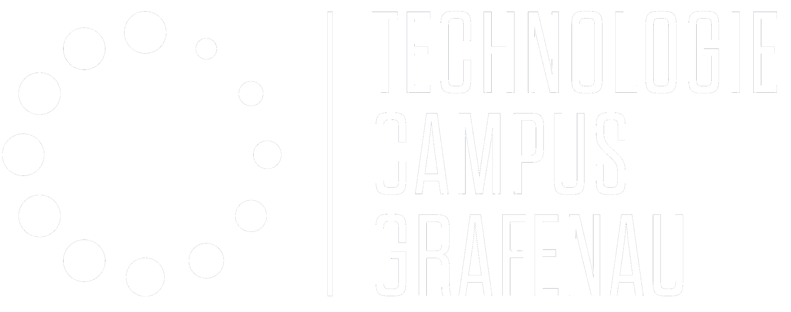
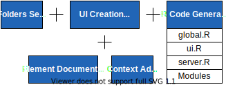
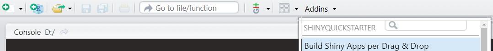

```{r include=FALSE}
library(shiny)
```

class: center, middle, exclude, background_blue

<div>
  <div style='font-family:MakDah;font-size:110px'>ShinyQuickStarter</div>
  <div style='font-size:50px'>Build Shiny Apps per Drag & Drop</div>
  <div style='padding-bottom:20px;font-family:serif'>
    ________________________________________________________________________
  </div>
  
  
  <div style='padding-top:20px;padding-bottom:20px'>
  <div style='font-size:25px;padding-bottom:20px'>Leon Binder</div>
</div>

---

# Motivation

RStudio addin that integrates the

<div style="margin-top:-1%">
  
</div>

--

<div style="margin-top:-15px">
  <div>Focus on</div>
  <ul>
    <li>Usability during the entire app development process</li>
    <ul>
      <li>Prototyping, Initial Setup, Extending (<a href="https://shiny.rstudio.com/articles/modules.html">Modules</a>)</li>
    </ul>
    <li>User Experience</li>
    <ul>
      <li>Beginner friendly design for new developers</li>
      <li>Sufficient functionality/complexity for advanced developers</li>
    </ul>
  </ul>
</div>

---

# Generatable Code

<div style="padding-top:-5%">
  <div style="float:left;width:49%;padding-right:1%">
    <div>global.R</div>
    
```r
*library(shiny)
*library(plotly)
library(data.table)

# Load data.
data = fread("data/data.csv")

*# Source functions.
*function_files = list.files(path = "functions", full.names = TRUE, recursive = TRUE)
*
*for (file in function_files) {
*  source(file, encoding = "UTF-8")
*}
*
*# Source modules.
*module_files = list.files(path = "modules", full.names = TRUE, recursive = TRUE)
*
*for (file in module_files) {
*  source(file, encoding = "UTF-8")
*}
```

  </div>

--

  <div style="float:left;width:49%;padding-right:1%">
    <div>ui.R</div>
    
```r
*ui <- navbarPage(
*  title = "useR!2021",
*  tabPanel(
*    title = NULL,
*    icon = icon("home"),
*    sidebarLayout(
*      sidebarPanel(
*        fileInput(
*          inputId = "upload",
*          label = "Upload",
*          accept = c(".csv")
*        )
*      ),
*      mainPanel(
*        plotlyOutput(
*          outputId = "data"
*        )
*      )
*    )
*  )
*)
```

  </div>
</div>
  
---

# Generatable Code

<div style="padding-top:-5%">
  <div style="float:left;width:49%;padding-right:1%">
    <div>server.R</div>
    
```r
*server <- function(input, output, session) {
*  output$data <- renderPlotly({
     fig = plot_ly(
       data = iris, x = ~Sepal.Length, y = ~Petal.Length, color = ~Species,
       type = "scatter", mode = "markers"
     ) %>%
     layout(
       title = "Sepal Length vs. Petal Length",
       xaxis = list(title = "Sepal Length"),
       yaxis = list(title = "Petal Length"),
       legend = list(orientation = "v", title = list(text = "<b>Species</b>"))
     )
     fig
*  })
*}
```

  </div>

--

  <div style="float:left;width:49%;padding-right:1%">
    <div>module.R</div>
    
```r
*data_ui <- function(id) {
*  ns = NS(id)
*
*  tagList(
*    wellPanel(
*      dataTableOutput(
*         outputId = ns("data")
*      )
*    )
*  )
*}
*
*data_server <- function(id) {
*  moduleServer(id, function(input, output, session) {
*    output$data <- renderDataTable({
       iris
*    }, options = list(searching = FALSE, lengthChange = FALSE, pageLength = 5))
*  })
*}
```

  </div>

</div>

---

class: center, middle, exclude, background_blue

<div>
  <div style='font-family:MakDah;font-size:150px'>Demonstration</div>
</div>

---

# Get Started

Install the **ShinyQuickStarter** package from [CRAN](https://cran.r-project.org/web/packages/ShinyQuickStarter/index.html):

```{r eval=FALSE, tidy=FALSE}
install.packages("ShinyQuickStarter")
```

Launch the addin through the terminal

```{r eval=FALSE, tidy=FALSE}
ShinyQuickStarter::shinyQuickStarter()
```

or through RStudio



---

# Further development

--
- Extension by **shinydashboardPlus**

--
- Export/Import of current state

--
- Allowing movement of UI Elements

--
- Enabling connections between Inputs and Outputs

--
- Adding arguments/return for Modules

---

# Contact

<div style="padding-bottom:50px"></div>

Leon Binder  
Research Team „Business Data Analytics & Optimization“  
  
THD – Deggendorf Institute of Technology  
Technology Campus Grafenau  
Hauptstraße 3  
DE-94481 Grafenau  
E-Mail: leon.binder@th-deg.de  
Web: <a href='https://www.th-deg.de/tc-grafenau-en'>https://www.th-deg.de/tc-grafenau-en</a>

---

class: center, middle, exclude background_blue

<div style='display:inline-flex'>
  <div style='font-family:MakDah;font-size:110px'>Thanks!</div>
  <div>
    
    <figcaption style="font-size:small">© Francisco Etchart</figcaption>
  </div>
</div>


