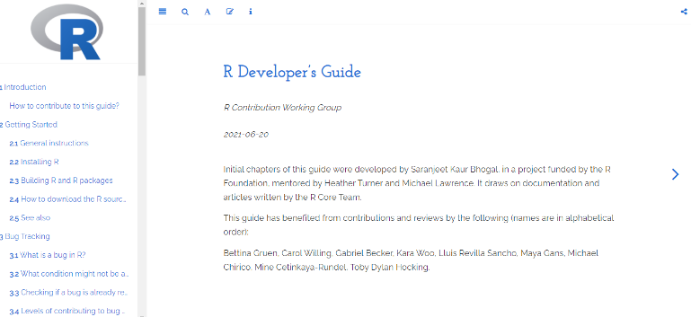

layout: true

background-image: url(useR_logo.png)
background-position: 0% 100%;
background-size: 10%

---

class: middle

# R Contribution Working Group 

--

## Mentors

Heather Turner, Michael Lawrence

--

## Funded by

The R Foundation

---

class: middle

#  R Contribution Working Group 

--

## Reviewers

(Names are in alphabetical order)

Bettina Gruen, Carol Willing, Gabriel Becker, Kara Woo, Lluís Revilla Sancho, Maya Gans, Michael Chirico, Mine Çetinkaya-Rundel, Toby Dylan Hocking

---

# Why this Guide?

--

- Documentation of how to contribute to R Core is dispersed 

- This guide will facilitate the onboarding of new contributors to R
Core

--

## Some statistics

--

- There are 20 R Core Developers at present. Source: [The R Project website](https://www.r-project.org/contributors.html) 

--

- Out of approximately 57K respondents, 5.7% (approximately 3K) said that they mostly use R. Source: [Stack Overflow Developer Survey 2020](https://insights.stackoverflow.com/survey/2020#most-popular-technologies)

---

# Where is the R Developer's Guide hosted?

--

As of now, the R Developer's Guide source code is hosted on the [Forwards Github rdevguide repository](https://github.com/forwards/rdevguide) and compiled as the R Developer's Guide which you can find at [bit.ly/rdevguide](https://forwards.github.io/rdevguide/). 

---

## Inspiration

--

The format and structure of the chapters in this Guide are highly inspired by the [Python Developer's Guide](https://devguide.python.org/).

--

.center[

.caption[
First page of the Guide
]

]

---

# Getting Started

--

- Instructions on how to install R and tools required to build R and R packages in Windows.

--

- Windows is the most widely used platform among general R users, especially in parts of the world that are currently under-represented in the contributor community. 

--

Three main releases of R available to install:

- Official release (`r-release`),

- Patched release (`r-patched`), and

- Development release (`r-devel`).

--

To build R and R packages in Windows you would require to install `RTools` and a distribution of LaTeX.

---

# Bug tracking

--

- Distinguish between what is a bug and what might not be a bug in R

- Once you are confirmed that there is a bug, check if it is already reported

- Create an account on Bugzilla. To get a Bugzilla account, please send an e-mail to `bug-report-request@r-project.org`, briefly explaining why you need an account, from the address that you want to use as your login.

--

Levels of contributing:

- Report the bug (if not already reported)

- Test the bug

- Fix the bug

---

# Bug tracking (Continued)

--

You may find a bug in:

-  R-Core supported packages (`Maintainer: R Core Team <R-core@r-project.org>`, run `maintainer("package_name")`), their documentations, and/ or in the R language implementation

- In packages and/or their documentations which are not supported by the R-Core

--

In R run the command `bug.report(package = "package_name")` for reporting the bug, whereas on RStudio use `utils::bug.report(package = "package_name")`

--

Expectations of a good bug report: provide a minimal reproducible example, mention the software architecture, use inbuilt data sets as far as possible

--

Examples of bug reports submitted to the bug tracker are shared 

---

# Reviewing Bugs

--

Help by reviewing the bug reports already present on Bugzilla (advanced search may be used to find reports on specific topics)

--

What can you do?

- Check if the bug is reproducible and mention the steps to reproduce it

- Check if information like the machine architecture, version of R, and the operating system on which the bug occurred is mentioned or not. If not, add it

---

# Source of functions

--

You may want to have overview of the R codebase just out of curiosity or maybe to gain more insight into what a particular function is actually doing

--

- Find the R source code

- Find the C source code

---

# Lifecycle of a patch

--

Submit a patch when you come across a bug in R and you have an idea of how to fix it!

--

A patch: The set of differences (additions and/or deletions) between two versions of code.

--

To submit a patch, you need the subversion (SVN) client and the latest developer version of R.

--

Follow the guidelines for making good patches.

--

Get your patch reviewed and also help by reviewing patches already submitted on Bugzilla.

---

# Documenting R

--

- Follow the .Rd format: Header, Body, Footer.

- Follow the basic rules of documentation.

- Help by correcting typos in the documentation.

---

# Testing pre-release R versions

--

You can also help with testing of pre-release versions of R.

--

If possible use fresh package library for testing or even better to use virtual machines for testing.

--

What can you test?

- Your own programs

- Your own workflows

- Your special ways of installing or setting up R

- Things that interact with external libraries

- Interactive R packages

---

# Where to get help?

--

Slack and Mailing Lists

--

The [R-devel slack](https://r-devel.slack.com/) channels:

- bugreports-for-review

- core-dev-help

- core-documentation

- core-translation

- patches-for-review

--

Mailing lists: [R-devel](https://stat.ethz.ch/mailman/listinfo/r-devel), [R-help](https://stat.ethz.ch/mailman/listinfo/r-help), and [R-package-devel](https://stat.ethz.ch/mailman/listinfo/r-package-devel).

---

# News and announcements

--

- [Blog](https://developer.r-project.org/Blog/public/)

- [Conferences](https://www.r-project.org/conferences/)

- [The R Journal](https://journal.r-project.org/) (The R news is a separate news section on updates to R, though R core members also contribute regular articles on big changes to R.)

- Mailing lists: [R-announce](https://stat.ethz.ch/mailman/listinfo/r-announce) and [R-packages](https://stat.ethz.ch/mailman/listinfo/r-packages)

- Twitter handle: `@_R_foundation` 

---

# Developer tools

--

This chapter focuses on how Windows users can get these tools (e.g. Windows clients).

--

Subversion (svn) client

--

[grep](https://en.wikipedia.org/wiki/Grep)

--

[Git](https://en.wikipedia.org/wiki/Git)

--

GitHub

- R Core is maintained in SVN, but some recommended packages are on GitHub

- [Creating a pull request](https://docs.github.com/en/github/collaborating-with-issues-and-pull-requests/creating-a-pull-request)
  
- [Opening an issue from code](https://docs.github.com/en/github/managing-your-work-on-github/opening-an-issue-from-code)
  
- [Resolving a merge conflict on GitHub](https://docs.github.com/en/github/collaborating-with-issues-and-pull-requests/resolving-a-merge-conflict-on-github)

---

# How to contribute to the R Developer's Guide?

--

To be able to edit this guide, you need to have a GitHub account. After you log-in to GitHub, click on the ‘Edit’ icon highlighted with a red ellipse in the image below: 

--

.center[

 

.caption[
Highlighted edit icon for contribution
]

]

--

This will take you to an editable version of the source R Markdown file that generated the page you are on, and you can suggest your edits there.

--

To raise an issue about the guide’s content or to make a feature request, use the [issue tracker](https://github.com/forwards/rdevguide/issues).

--

Maintainers and contributors are requested to follow the [code of conduct](https://github.com/forwards/rdevguide/blob/master/CONDUCT.md).

--

Call for Action: Join us and help in the further development of this guide!

---

# Further work

--

- In near future we will include materials on how to translate warning messages and errors in R to non-English languages!

- We also want to expand this guide to include instructions for non-Windows operating systems.

---

class: center, middle

# Thanks!

Slides created via the R package [**xaringan**](https://github.com/yihui/xaringan).
